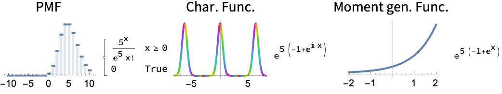
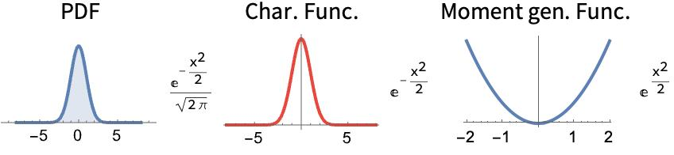
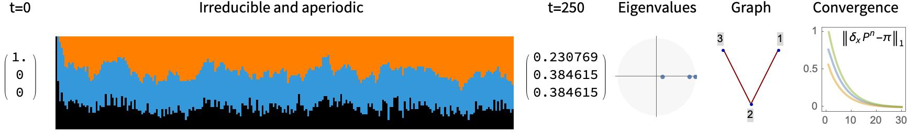
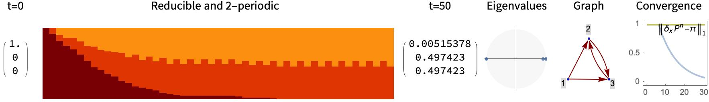
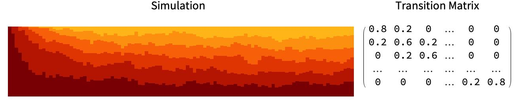
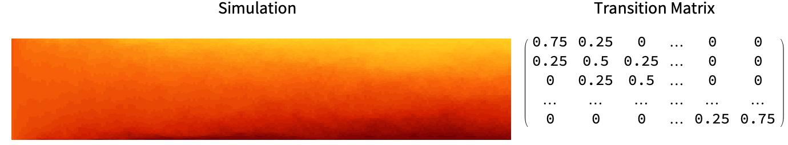
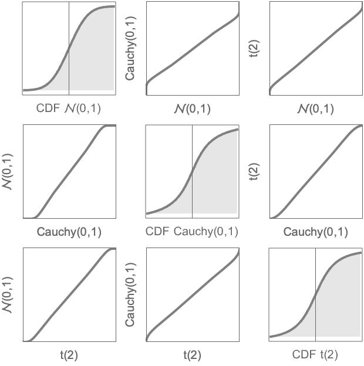
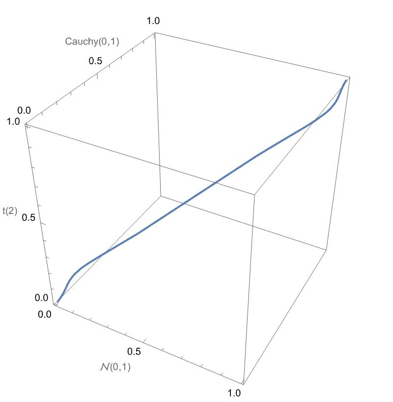
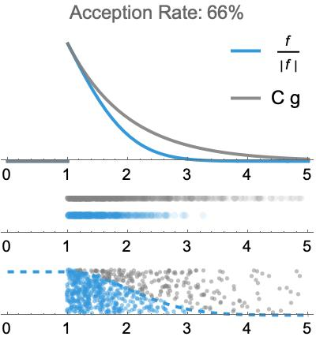

# Stochastic Visualization Mathematica Package
A package for visualizing uncertainty, Markov Chains and Monte-Carlo simulations. It currently provides functionality for:

- Quantile-Quantile plotting (2d/3d) to assess the quality of random number generation methods
- Visualizing the acceptance-rejection method
- Simulating Markov chains
- Simulating Random Walks

### Usage
To use this package, include `StochasticVisualization.wl` in your project's folder and execute:
```mathematica
SetDirectory[NotebookDirectory[]];
Get["StochasticVisualization`"]
```
Then the functions (all with the prefix `SV`, like in `SVRandomWalkSimulation`) will be accessable directly. The file `Usage.nb` goes into more detail.

### Installation
A compiled `paclet` file can be build from the `wl` source with `PacletBuild`.

## 1. Probability Distributions

### SVDistributionPlot

Plots the PDF/PMF, characteristic function (arg-abs plot) and moment-generating function for a given distribution with discrete or continuous domain.

```mathematica
SVDistributionPlot[PoissonDistribution[5], x]
```


```mathematica
SVDistributionPlot[NormalDistribution[], x]
```



## 2. Markov Chains

### SVDiscreteMarkovChainSimulation

Simulates the path of a discrete Markov chain (defined by a matrix $P$ of transition probabilities and initial values) and visualizes the eigenvalues of $P$, a graph of possible transitions, and the convergence to a stationary distribution.

```mathematica
SVDiscreteMarkovChainSimulation[0.1 {
    {5, 5, 0},
    {3, 6, 1},
    {0, 1, 9}
}, Array[1 &, 50], 250, PlotLabel -> "Irreducible and aperiodic"]
```


```mathematica
colors = ColorData["SolarColors"][(# - 1)/3] & /@ Range[3];
SVDiscreteMarkovChainSimulation[{
    {0.9, 0.05, 0.05},
    {0, 0, 1},
    {0, 1, 0}},
Array[1 &, 100], 50, ChartStyle -> colors, 
 PlotLabel -> "Reducible and 2-periodic"]
```



### SVRandomWalkSimulation

Simulates the path of a discrete Markov chain with a random walk transition matrix.

```mathematica
SVRandomWalkSimulation[6, 0.2, Array[1 &, 100], 100]
```


```mathematica
SVRandomWalkSimulation[30, 0.25, Array[15 &, 100], 200]
```



## 3. Assessing Random Number Generation

### SVQuantilePlot

Plots QQ and CDF plots for any list of distributions.

```mathematica
SVQuantilePlot[
    {
        NormalDistribution[],
        CauchyDistribution[0, 1],
        StudentTDistribution[2]
    },
    CDFDomain -> {-3, 3}
]
```



### SVQuantilePlot3D

Displays a 3-dimensional Quantile-Quantile-Quantile plot of three different distributions.

```mathematica
SVQuantilePlot3D[
    NormalDistribution[], 
    CauchyDistribution[0, 1],
    StudentTDistribution[2],
    ImageSize -> 400
]
```



### RejectionPlot

Applies the [Acception-Rejection Method](https://en.wikipedia.org/wiki/Rejection_sampling) and visualizes the result, to generate random samples with a target density $\frac{f}{\vert f\vert}$ (that fulfills $f\leq C g(x)$ for some $C>0$) by sampling from a distribution $g$.

```mathematica
gDistribution = TransformedDistribution[
    1 + X,
    X \[Distributed] ExponentialDistribution[1]
];
SVRejectionPlot[
    Piecewise[{{E^(-x^2/2), 1 <= x}, {0, True}}],
    {x, 0, 5},
    gDistribution,
    1/Sqrt[E],
    NSamples -> 700
]
```

